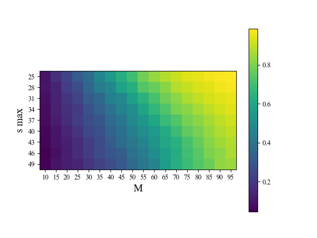
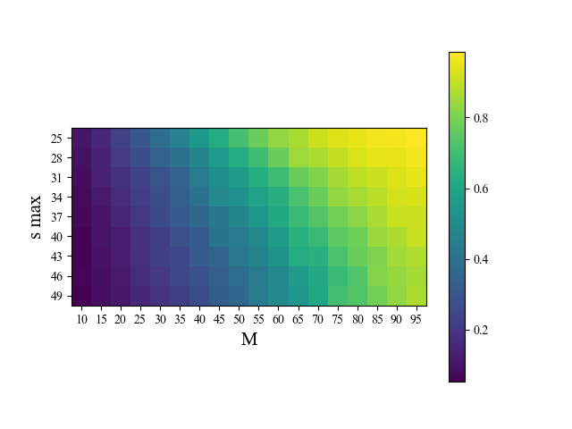
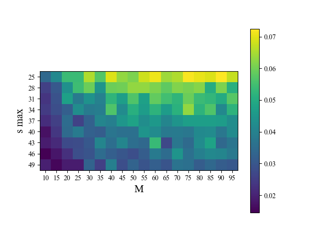

# Orthogonal-Matching-Pursuit

This is a implementation of Orthogonal Matching Pursuit algorithm for sparse approximation, which is a fundamental method for signal processing and signal compression.

The sparse approximation problem aims to find the sparsest representation of signal from a redundant dictionary.

This implementation contains a series of experiments:
1. Sparse approximation with noiseless signal
2. Sparse approximation with noisy signal
3. Sparse approximation for noiseless image compression and reconstruction
4. Sparse approximation for noisy image compression and reconstruction

- [Experiment setup](Project2019.pdf)

## Signal approximation and Image reconstruction Result 

- Exact recovery rate for $\sigma^2=0$(Noiseless)

- Exact recovery rate for $\sigma^2=0.001$

- Exact recovery rate for $\sigma^2=0.01$

More details shown in the [report](report/OMP.pdf)

